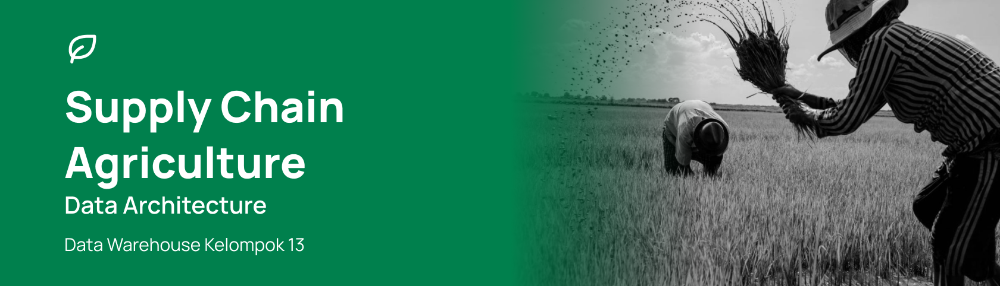
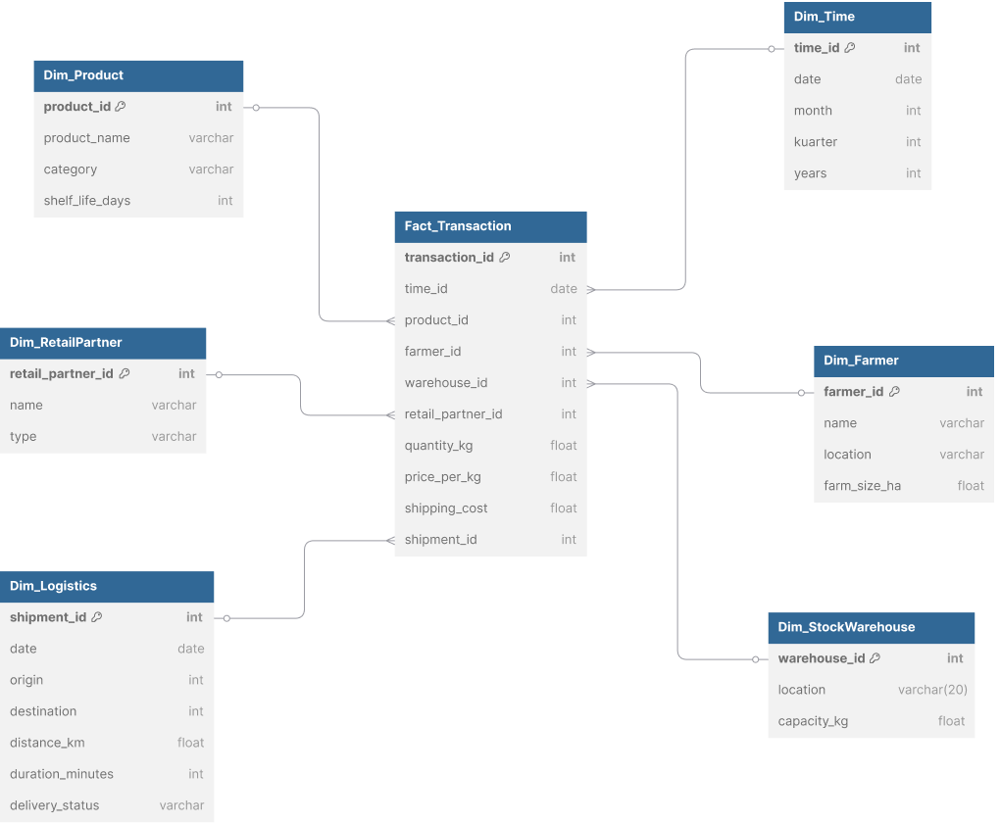

# Agriculture Supply Chain Data Warehouse
Industri agrikultur di Indonesia memiliki potensi besar untuk berkembang melalui penerapan teknologi digital. Salah satu pendekatan strategis yang sedang berkembang adalah pengembangan bisnis agrikultur berbasis platform digital, yang berupaya mengatasi permasalahan klasik seperti rantai distribusi yang panjang, keterbatasan akses pasar bagi petani, serta minimnya data terstruktur untuk mendukung pengambilan keputusan operasional dan strategis (Putri & Sembiring, 2022; Kementerian Pertanian RI, 2021).

# Supply Chain Concept

ERD

## Kelompok SupplyChain

Ketua Virdio Samuel Saragih - 122450124

| Nama | NIM |
|------|-----|
| Josua Alfa Viando Panggabean | 121450061 |
| Try Yani Rizki Nur Rohmah | 122450020 |
| Priska Silvia Ferantiana | 122450053 |
| Dearni Monica Br Manik | 122450075 |
| Ferdy Kevin Naibaho | 122450107 |